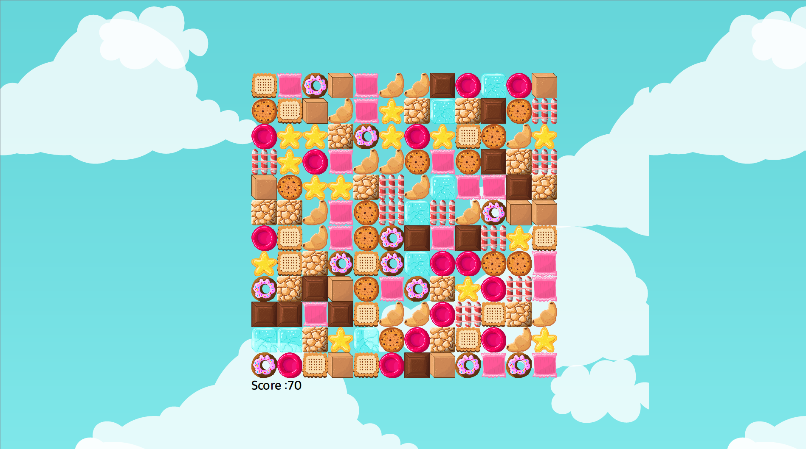

# CPP_Match Three Puzzle Game Project
[2021-01-31 ~ 2021-02-02]  Match Three Puzzle Game Project with C++ using Qt Framework

### 프로그램 개발 환경
- Language : C++
- OS : Microsoft Windows 10
- IDE : Microsoft Visual Studio 2019 16.8.4

### 게임 규칙

```text
1. 수직으로 3개가 매치되면 점수 획득 및 삭제
2. 수평으로 3개가 매치되면 점수 획득 및 삭제
3. 빈 공간은 위에 있는 블록이 내려와 채워짐.
4. 블록을 옮길 때, 매치되지 않는다면 제자리로 돌아옴.
```

### 실행 화면


